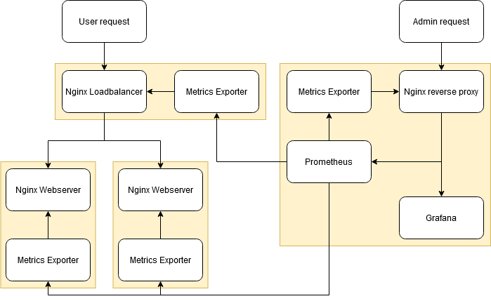

# Static site deployment and monitoring

This is a basic solution that creates an environment consisting of loadbalancers/reverse proxies, static website servers and a Prometheus/Grafana monitoring stack.

Repository consists of three distinct parts:
* [content](/content) contains static website files used by both deployment methods
* [docker](/docker) has everything for local experimentation and more or less resembles the multi-server architecture used by Ansible
* [ansible](/ansible) is for deployment to a remote set of nodes/instances or local VMs

## Getting started

Prerequisites for local usage include [Docker](https://docs.docker.com/engine/install/) and [Docker Compose](https://docs.docker.com/compose/install/). For remote deployment only [Ansible](https://docs.ansible.com/ansible/latest/installation_guide/intro_installation.html) is required.

Further info about each method of deployment is in their respective subdirectories.

## Architecture

## Note

Everything here is for experimentation/fiddling purposes only. None of it is even development environment ready and there's a lot of ~~horribly mangled nginx configs~~ unoptimal choices and shortcomings.
